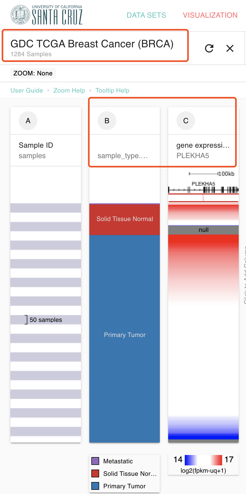
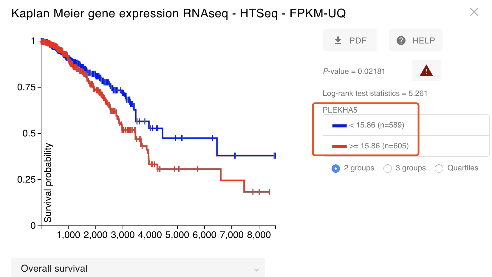
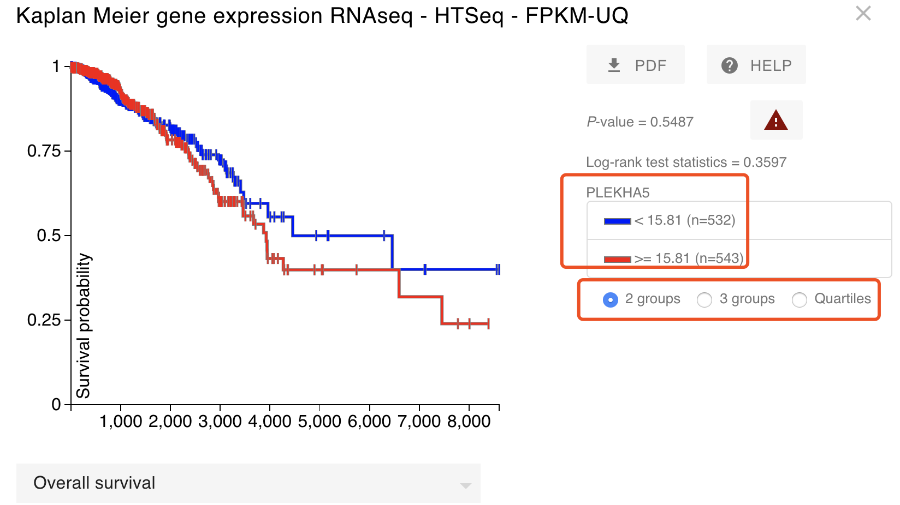
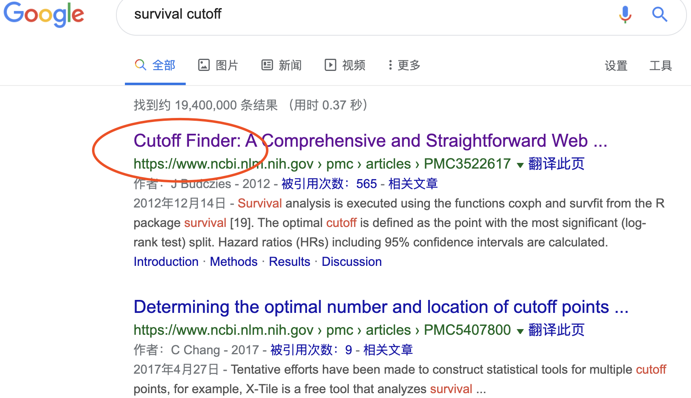
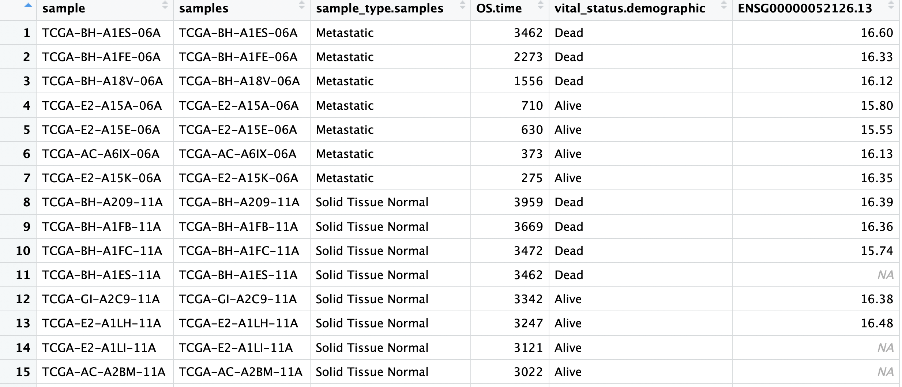
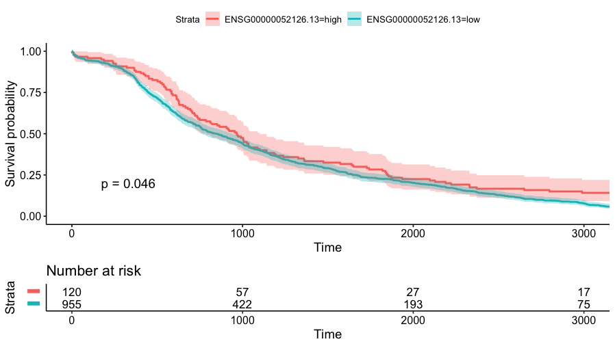

# 生存分析就是一个任人打扮的小姑凉

最近接到TCGA分析需求，想看看指定基因在指定癌症是否具有临床意义（也就是生存分析是否有统计学显著效果咯！）其实很早以前我在生信技能树就号召粉丝讨论过这个问题：[集思广益-生存分析可以随心所欲根据表达量分组吗](https://mp.weixin.qq.com/s/pQL8jA38gDPO5xVDG0L94w) 这里我做实力演绎一下。

我这里选择最方便的 网页工具：https://xenabrowser.net/heatmap/  选择合适的数据集及样本信息还有基因来演示一下，随便选择一个基因一个癌症吧，如下：



这个时候，我草率的制作了生存分析图如下：



(*@ο@*) 哇～非常显著，差点准备交差了，然后下意识的看了看病人数量，TCGA数据库的BRCA病人没道理居然快1200个了，肯定是有什么地方错误了，重新看了看，的确是因为没有顾虑到里面有正常组织测序的那些病人，怎么说呢，相当于把有正常组织测序的那一百多个病人，在我这个生存分析里面计算了两次，他们的生存时间信息，生存状态都重复计算了，所以实际上这个生存分析是错误的。

过滤一下，仅仅是保留tumor的表达量信息和病人临床信息，再次制作生存分析曲线，如下所示：



可以看到，之前明明是显著的结果消失了，而且不管是使用哪种表达量划分方式，都达不到统计学显著阈值。

是不是就没有办法了呢？

当然不是，还可以使用R包，一个非常棒的外国小哥博客写的很清楚：http://r-addict.com/2016/11/21/Optimal-Cutpoint-maxstat.html 

还有专门的文章，这里就不细心讲解啦。



### 使用survminer包的surv_cutpoint函数找寻最近生存分析阈值

外国小哥博客写的很清楚：http://r-addict.com/2016/11/21/Optimal-Cutpoint-maxstat.html 我们现在就测试一下这个流程。

首先下载我们前面的数据文件：`'PLEKHA5-BRCA.tsv'` 内容如下：

总共6列，在前面的 网页工具：https://xenabrowser.net/heatmap/  选择对应的信息下载即可：



然后是R代码读入上面的文件，主要是**列名**需要保证正确无误！！！

```r
rm(list=ls())
options(stringsAsFactors = F)
# install.packages("survminer")
library(survminer)
a=read.table('PLEKHA5-BRCA.tsv',header = T,sep = '\t')
head(a)
dat=a[a$sample_type.samples=='Primary Tumor',4:6]
head(dat)
dat$vital_status.demographic=ifelse(dat$vital_status.demographic=='Alive',1,0)
surv_rnaseq.cut <- surv_cutpoint(
  dat,
  time = "OS.time",
  event = "vital_status.demographic",
  variables = c("ENSG00000052126.13")
)
summary(surv_rnaseq.cut)
plot(surv_rnaseq.cut, "ENSG00000052126.13", palette = "npg")

surv_rnaseq.cat <- surv_categorize(surv_rnaseq.cut) 

library(survival)
fit <- survfit(Surv(OS.time, vital_status.demographic) ~ ENSG00000052126.13,
               data = surv_rnaseq.cat)
ggsurvplot(
  fit,                     # survfit object with calculated statistics.
  risk.table = TRUE,       # show risk table.
  pval = TRUE,             # show p-value of log-rank test.
  conf.int = TRUE,         # show confidence intervals for 
  # point estimaes of survival curves.
  xlim = c(0,3000),        # present narrower X axis, but not affect
  # survival estimates.
  break.time.by = 1000,    # break X axis in time intervals by 500. 
  risk.table.y.text.col = T, # colour risk table text annotations.
  risk.table.y.text = FALSE # show bars instead of names in text annotations
  # in legend of risk table
)

```

重要的的列名是：

```r
  time = "OS.time",
  event = "vital_status.demographic",
  variables = c("ENSG00000052126.13")
```

如果是你自己的数据集，需要稍微修改哦。

见证奇迹的时刻：



是不是统计学显著啦！！！

函数帮我们选择的分组；


可以看到这个函数，为了统计学显著，可以说是无所不用其极！

### 更多TCGA教程见；

- [使用R语言的cgdsr包获取TCGA数据](http://mp.weixin.qq.com/s?__biz=MzAxMDkxODM1Ng==&mid=2247486492&idx=1&sn=3a7251244377fdd4b2a3aa5c8cd1131a&chksm=9b484ca7ac3fc5b1a21202cf25ff15a8eec434424aa3e48787129fa6f5e66ebe57ffcb631772&scene=21#wechat_redirect)（cBioPortal）
- [TCGA的28篇教程- 使用R语言的RTCGA包获取TCGA数据](http://mp.weixin.qq.com/s?__biz=MzAxMDkxODM1Ng==&mid=2247486585&idx=1&sn=3035f6420904aad2c8161b362cdeb472&chksm=9b484cc2ac3fc5d479fc5bce3d68d4666b763652a21a55b281aad8c0c4df9b56b4d3b353cc4c&scene=21#wechat_redirect) （离线打包版本）
- [TCGA的28篇教程- 使用R语言的RTCGAToolbox包获取TCGA数据](http://mp.weixin.qq.com/s?__biz=MzAxMDkxODM1Ng==&mid=2247486728&idx=1&sn=3990dff5efccedc060443b7f3af3b6ee&chksm=9b484db3ac3fc4a51ee34ba578280d89ea6159a48d9dec1c7ecd5dbe208c53a1b36c439de75d&scene=21#wechat_redirect) （FireBrowse portal）
- [TCGA的28篇教程-  批量下载TCGA所有数据](http://mp.weixin.qq.com/s?__biz=MzAxMDkxODM1Ng==&mid=2247486746&idx=1&sn=b7c5ad7eff8cffb3620756f5feaff587&chksm=9b484da1ac3fc4b741a6e3b59ba1bf668a11e21eb610f1a1d4582e33d429c67c14e6659c0771&scene=21#wechat_redirect) （ UCSC的 XENA）
- [TCGA的28篇教程- 数据下载就到此为止吧](http://mp.weixin.qq.com/s?__biz=MzAxMDkxODM1Ng==&mid=2247486789&idx=1&sn=bf65ccc84b3d920b284118d146006f54&chksm=9b484dfeac3fc4e86174a536b33edeb60fa064fa10d9528acdc2e2b7c0ee72c4bdedeb0b7180&scene=21#wechat_redirect)
- [TCGA的28篇教程- 指定癌症查看感兴趣基因的表达量](http://mp.weixin.qq.com/s?__biz=MzAxMDkxODM1Ng==&mid=2247486845&idx=1&sn=b735a4690d9f4efdd601bc8ddd9c4362&chksm=9b484dc6ac3fc4d025c20665213efa64d4b83ff3d923633c8f76d7aedf1a21d4b5feb4086e8c&scene=21#wechat_redirect)
- [TCGA的28篇教程- 对TCGA数据库的任意癌症中任意基因做生存分析](http://mp.weixin.qq.com/s?__biz=MzAxMDkxODM1Ng==&mid=2247486915&idx=1&sn=19a6e45f82712e7a94d409e22de7a23a&chksm=9b484d78ac3fc46e92f63cc0c9918e9988c72bb9726152002a4d00b58fc9ea3751fa1732b946&scene=21#wechat_redirect)
- [TCGA的28篇教程-整理GDC下载的xml格式的临床资料](http://mp.weixin.qq.com/s?__biz=MzAxMDkxODM1Ng==&mid=2247487143&idx=1&sn=ac54a5a679af47f1ad5516631830d66d&chksm=9b484e1cac3fc70aead6b03efb5a393910bea818f9b36d8802307253b71b7a0657993fbaa447&scene=21#wechat_redirect)
- [TCGA的28篇教程-风险因子关联图-一个价值1000但是迟到的答案](http://mp.weixin.qq.com/s?__biz=MzAxMDkxODM1Ng==&mid=2247487152&idx=1&sn=244a799c035fd081e01964f4c2d39bed&chksm=9b484e0bac3fc71de3de79b4863ad5a118a1f735deac86e1b6b39627387016ccd2a6b07eef7e&scene=21#wechat_redirect)
- [TCGA的28篇教程-数据挖掘三板斧之ceRNA](http://mp.weixin.qq.com/s?__biz=MzAxMDkxODM1Ng==&mid=2247487183&idx=1&sn=8f5bde28f608e267e7195a83797da300&chksm=9b484e74ac3fc762ff2e209d54d27ceeacfa7a186f2433f30eceeb04966045ae14e3cb3bf8bb&scene=21#wechat_redirect)
- [TCGA的28篇教程-所有癌症的突变全景图](http://mp.weixin.qq.com/s?__biz=MzAxMDkxODM1Ng==&mid=2247487369&idx=1&sn=fed7321eb1dda047ed7ee9a8e01b8595&chksm=9b484f32ac3fc624dcf67f8e56d611e797cc2c477105093ae8593b003c8ba39eb3fff72c1b54&scene=21#wechat_redirect)
- [TCGA的28篇教程-早期泛癌研究](http://mp.weixin.qq.com/s?__biz=MzAxMDkxODM1Ng==&mid=2247487415&idx=1&sn=715eacae5c4e4373660eddb25b976dca&chksm=9b484f0cac3fc61a3df681d6fde596cf8b5f6c44e6f4f554c3888edcc691d04257a3f88e5108&scene=21#wechat_redirect)
- [TCGA的28篇教程-CNV全攻略](http://mp.weixin.qq.com/s?__biz=MzAxMDkxODM1Ng==&mid=2247487448&idx=1&sn=6b6335199b0c604d801c91a40ea051c8&chksm=9b484f63ac3fc675e33dbda1a028ca1e3eae3cb78b20743a6d942738c2041447746fda00e803&scene=21#wechat_redirect)

